# LTW Project 2021/2022
## Class 03 | Group 05

| **Name**         | **Email**                |
| ---------------- | ------------------------ |
| Alexandre Afonso | up201805455@edu.fc.up.pt |
| António Santos   | up201907176@edu.fc.up.pt |
| Tiago Antunes    | up201805327@edu.fc.up.pt |

## Features

- [x] Register
- [x] Login/Logout
- [x] Edit Profile
- [x] Add Restaurant
- [x] Edit Restaurant
- [x] Add Dishes
- [ ] Add Dish Photo
- [x] Edit Dish
- [x] Delete Dish

- [x] List Reviews
- [x] Customer Can Leave a Review
- [ ] Restaurant Owner Can Answer to Review
- [x] List Customer Orders
- [x] Change Order State

- [ ] Search Restaurants
- [x] Order Dishes
- [x] List My Orders
- [x] Mark Restaurant as Favourite
- [x] Mark Dish as Favourite

## Credentials

| **Username**  | **Password** | **Description**    |
| ------------- | ------------ | ------------------ |
| tiagotunes    | 1234         | Owner (Mc'Donalds) |
| alexafonso    | 1234         | Customer           |
| Jose Paulo    | 1234         | Driver             |

## Screenshots

> Screenshots of main pages

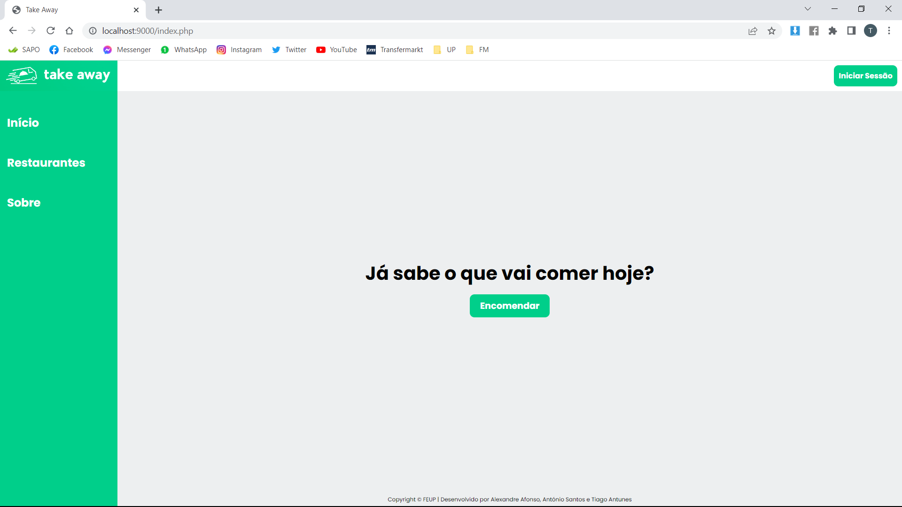

<i>Figure 1: Home page</i>

 

<i>Figure 2: About page</i>

 

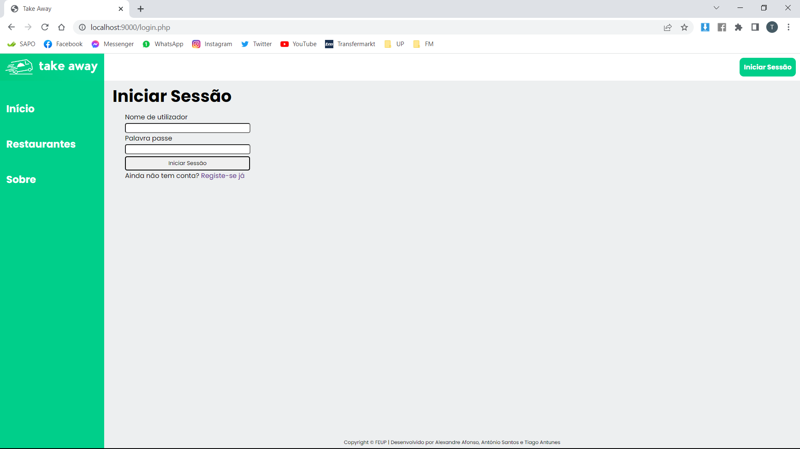

<i>Figure 3: Login page</i>

 

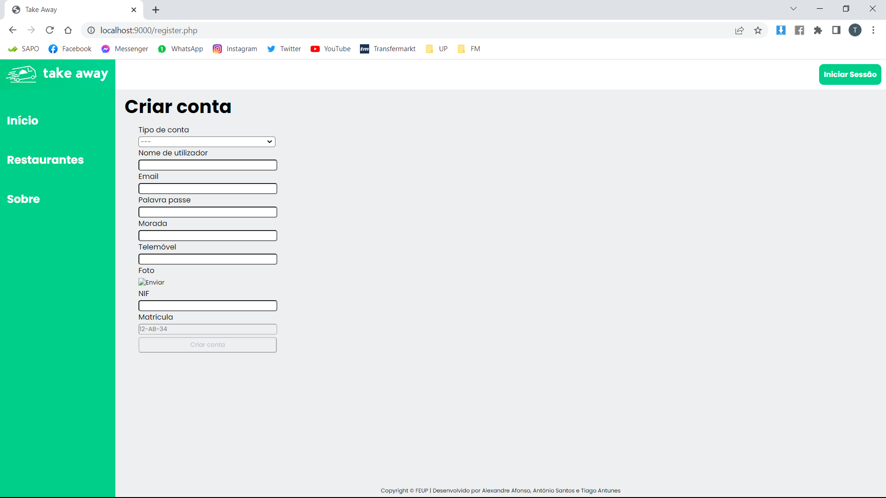

<i>Figure 4: Register user page</i>

 

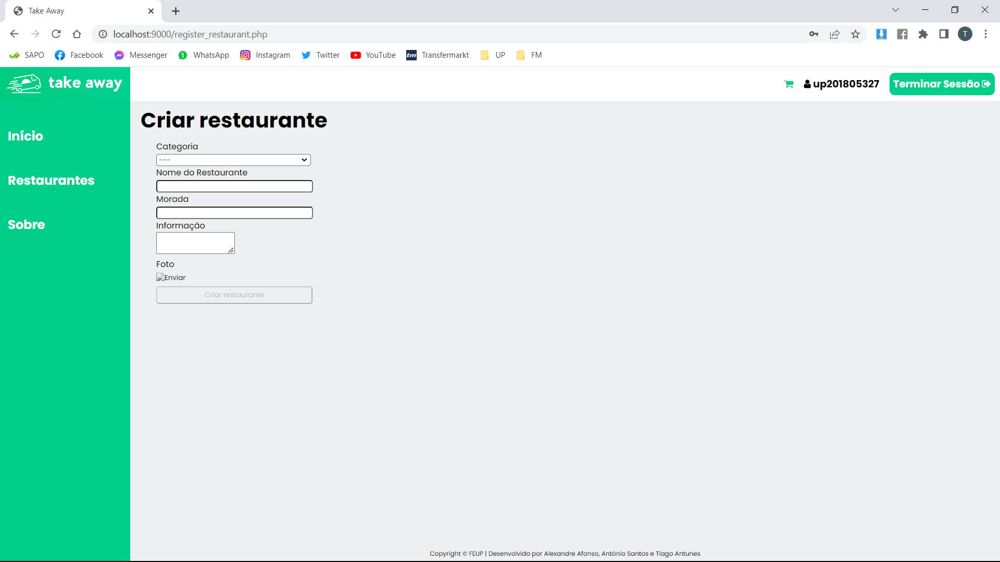

<i>Figure 5: Register restaurant page</i>

 

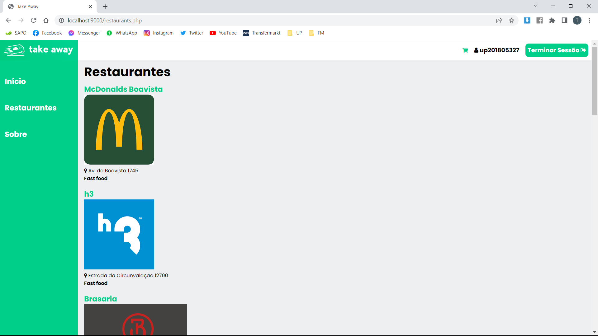

<i>Figure 6: All restaurants page</i>

 

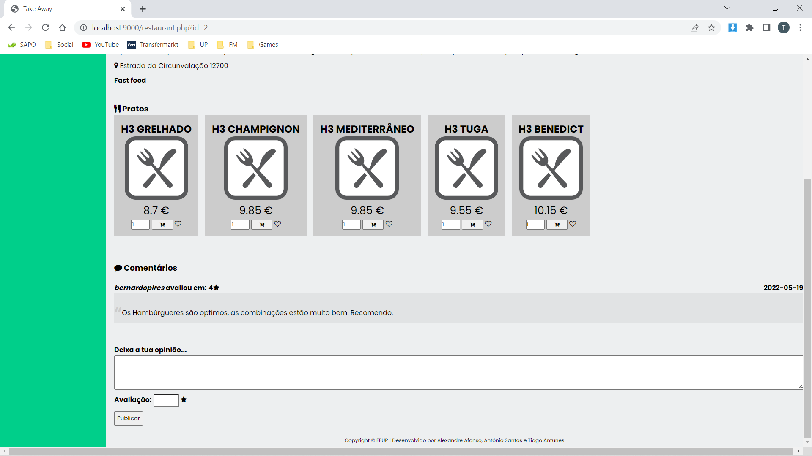

<i>Figure 7 and 8: Restaurant page</i>

 

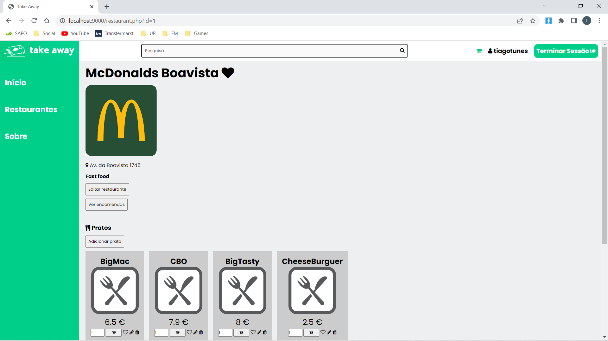
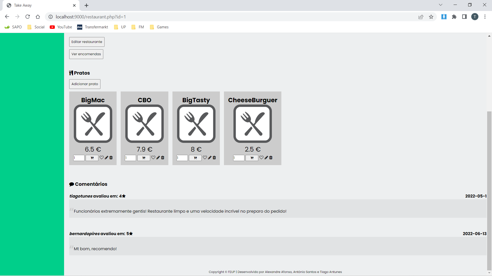

<i>Figure 9 and 10: Restaurant page as owner</i>

 

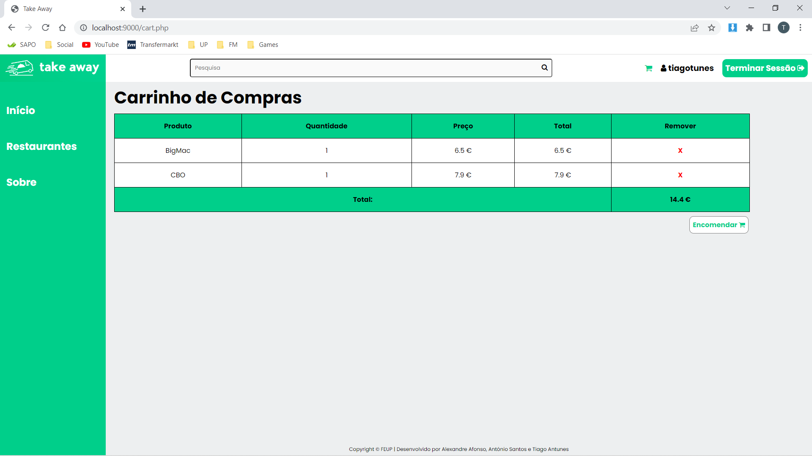

<i>Figure 11: Cart page</i>

 

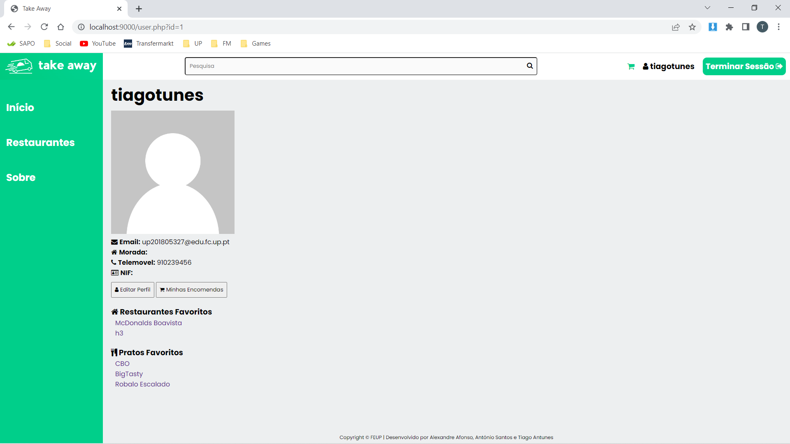

<i>Figure 12: User profile page</i>

 

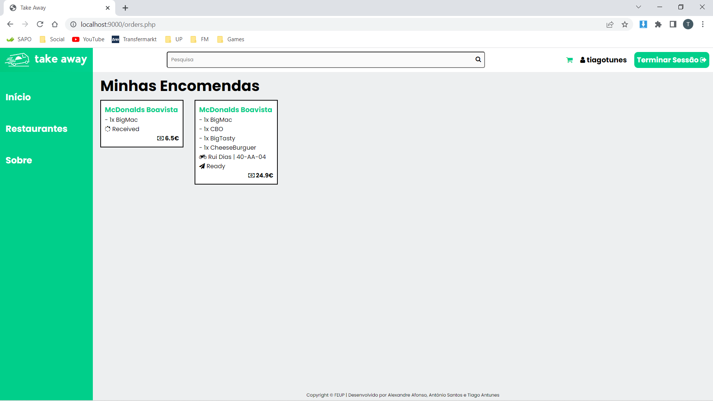

<i>Figure 13: My orders page</i>

 

<!-- 

<i>Figure _: _______ page</i>

  -->